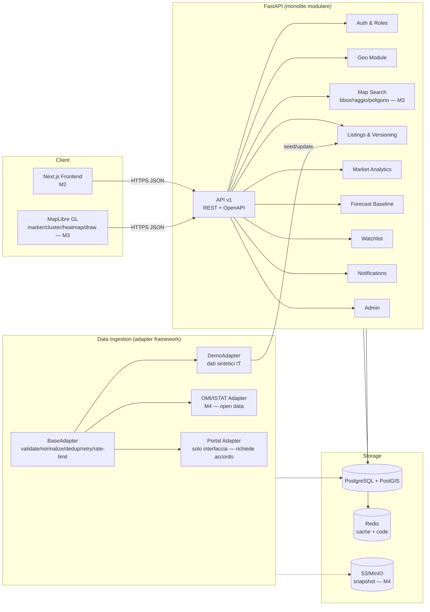
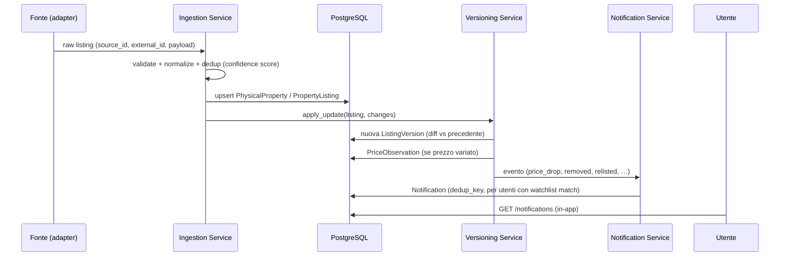

# REMIP — Architettura

Monolite modulare (vedi `PLAN.md` §6 per le alternative valutate e la motivazione).

## Componenti

## Flusso dei dati (aggiornamento annuncio → notifica)

## Moduli e confini

Regole del monolite modulare:
1. i router API dipendono da `services/`, mai l'inverso;
2. `adapters/` scrive solo tramite i servizi di ingestion/versioning, mai SQL diretto sui modelli di altri moduli;
3. eventi applicativi (per ora chiamate dirette al NotificationService, da M4 code Redis) sono l'unico canale ingestion→notifiche.

## API (v1, prefisso `/api/v1`)

| Area | Endpoint principali |
|---|---|
| Auth | `POST /auth/register`, `POST /auth/login`, `GET /auth/me` |
| Geo | `GET /geo/countries`, `GET /geo/areas` (filtri country/level/parent/q), `GET /geo/areas/{id}` |
| Listings | `GET /listings` (filtri, paginazione, sort), `GET /listings/{id}`, `GET /listings/{id}/history`, `GET /listings/{id}/comparables` |
| Market | `GET /market/metrics` (serie storica per area), `GET /market/summary` (KPI + variazioni 1/3/6/12m,5y), `GET /market/forecast` |
| Watchlist | CRUD `/watchlists`, `/watchlists/{id}/items` |
| Notifications | `GET /notifications`, `POST /notifications/{id}/read`, `POST /notifications/read-all` |
| Sources | `GET /sources` (provider, ToS, qualità, is_demo) |
| Admin | `GET /admin/stats`, `POST /admin/simulate/listing-update` (motore demo variazioni) |
| Map | `POST /map/search` (marker per bbox/raggio/poligono), `GET /map/areas-geo` (centroidi per livello amministrativo) |
| Health | `GET /health` |

Convenzioni: paginazione `limit/offset` con `total`; errori JSON uniformi
(`{"detail": ...}`); ogni risposta analitica include il blocco `data_context`
(source, period, observations, updated_at, quality, limitations, is_demo_data).

## Mappa e ricerca geospaziale (M3)

**Filtri spaziali in Python, non in SQL PostGIS.** `POST /map/search` applica
bounding-box, raggio e poligono disegnato a mano interamente in
`services/geo.py` (haversine + ray-casting PNPOLY), con un pre-filtro SQL sulla
bounding box per limitare i candidati prima del test esatto. Motivazione:
questa logica deve funzionare identica su SQLite (dev/test locale, come da
M1) e su PostgreSQL (compose) — query `ST_DWithin`/`ST_Contains` esisterebbero
solo su Postgres, spezzando l'avvio locale "zero servizi esterni" descritto
nel README. L'estensione PostGIS viene comunque abilitata all'avvio quando il
dialetto è PostgreSQL (`db/base.py::ensure_postgis`), così lo schema è pronto
per colonne geometry indicizzate quando il volume di annunci lo giustificherà
(M4+): a quel punto la sostituzione è isolata a `services/geo.py`, senza
toccare i router.

**Rendering mappa**: MapLibre GL con marker, clustering (nativo, via
supercluster integrato) e layer heatmap (nativo, pesato su `price_per_sqm`),
poligono disegnato a mano e cerchio di ricerca per raggio renderizzati come
overlay GeoJSON. Le tile di base sono raster OpenStreetMap pubbliche, a basso
volume, solo per la demo — vedi `docs/INTEGRATIONS.md` per i vincoli di ToS e
il provider da adottare prima di traffico in produzione.

## Strategia di testing

- **Unit**: servizi (versioning diff, forecast, comparables) — pytest.
- **Integration/API**: TestClient httpx su SQLite in-memory, seed ridotto deterministico.
- **Sicurezza base**: isolamento utenti, accesso admin, token invalidi.
- **E2E**: Playwright da M2 (frontend).
- **Geospaziali**: da M3 con PostGIS in compose (test marcati `postgis`).
- CI (GitHub Actions): ruff → mypy → pytest su ogni push.

## Strategia di deployment

- Dev: `docker compose up` (Postgres+PostGIS, Redis, backend) oppure backend standalone su SQLite.
- Ambienti separati via `.env` (mai committati); `.env.example` come contratto.
- Prod (da M6): immagini Docker su container host, Postgres gestito, migrazioni Alembic al deploy, backup automatici, logging strutturato + monitoring (health endpoint già presente).

## Sicurezza e privacy (implementato in M1 / pianificato)

M1: JWT HS256 con scadenza, PBKDF2-HMAC-SHA256 (210k iterazioni, salt per utente,
formato hash auto-descrittivo → migrabile ad argon2), ruoli user/admin, audit log,
validazione input Pydantic, ORM parametrizzato (no injection), CORS esplicito,
nessun segreto nel repo, dati demo privi di persone reali.
M4-M6: rate limiting distribuito, email verification, reset password, OAuth,
consensi, export/cancellazione account (GDPR), dependency/secret scanning in CI,
retention policy.
