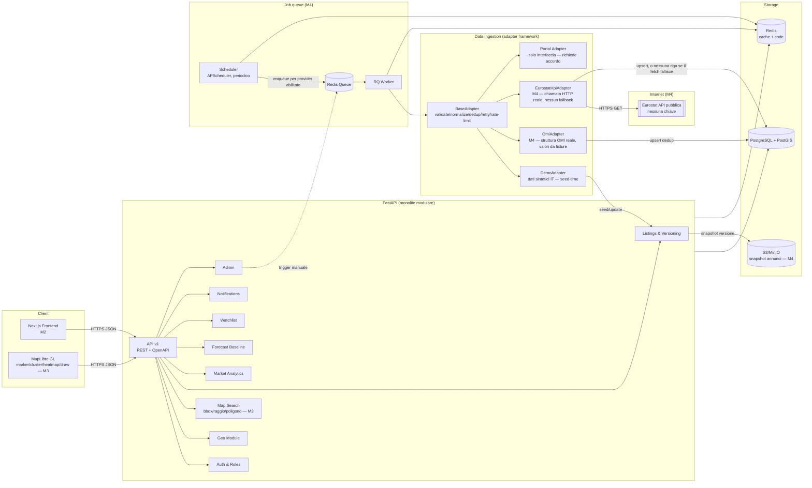
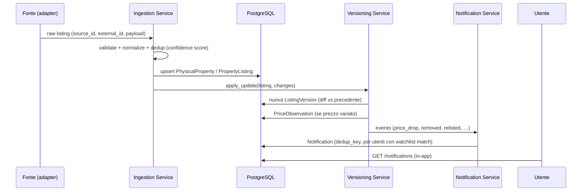

# REMIP — Architettura

Monolite modulare (vedi `PLAN.md` §6 per le alternative valutate e la motivazione).

## Componenti

## Flusso dei dati (aggiornamento annuncio → notifica)

## Moduli e confini

Regole del monolite modulare:
1. i router API dipendono da `services/`/`jobs/`, mai l'inverso;
2. `adapters/` scrive solo tramite i servizi di ingestion (`jobs/ingestion.py`)/versioning, mai SQL diretto sui modelli di altri moduli;
3. eventi applicativi (notifiche via NotificationService; ingestion via coda Redis/RQ da M4) sono gli unici canali asincroni — nessun altro broker introdotto.

## API (v1, prefisso `/api/v1`)

| Area | Endpoint principali |
|---|---|
| Auth | `POST /auth/register`, `POST /auth/login`, `GET /auth/me` |
| Geo | `GET /geo/countries`, `GET /geo/areas` (filtri country/level/parent/q), `GET /geo/areas/{id}` |
| Listings | `GET /listings` (filtri, paginazione, sort), `GET /listings/{id}`, `GET /listings/{id}/history`, `GET /listings/{id}/comparables`, `GET /listings/{id}/versions/{n}/snapshot` (M4), `POST`/`GET /listings/{id}/valuations` (stima persistita, M5), `POST /listings/compare` (2-4 annunci, M5) |
| Market | `GET /market/metrics` (serie storica per area), `GET /market/summary` (KPI + variazioni 1/3/6/12m,5y), `GET /market/forecast`, `GET /market/omi-quotations` (bande OMI per zona, M4), `GET /market/economic-indicators` (indicatori live Eurostat, M4), `GET /market/compare-areas` (2-4 aree, M5), `GET /market/explanation` (motore driver, M5) |
| Watchlist | CRUD `/watchlists`, `/watchlists/{id}/items` |
| Notifications | `GET /notifications`, `GET /notifications/digest` (M4), `POST /notifications/{id}/read`, `POST /notifications/read-all`, `GET`/`PUT /notifications/preferences` (frequenza + tipi silenziati, M5) |
| Sources | `GET /sources` (provider, ToS, qualità, is_demo) |
| Admin | `GET /admin/stats`, `POST /admin/simulate/listing-update` (motore demo variazioni), `POST /admin/ingestion/run/{provider_code}`, `GET /admin/ingestion/jobs` (M4), `GET /admin/users`, `POST /admin/users/{id}/deactivate`\|`reactivate` (M5), `POST /admin/sources/{code}/toggle` (kill-switch ToS, M5) |
| Map | `POST /map/search` (marker per bbox/raggio/poligono), `GET /map/areas-geo` (centroidi per livello amministrativo) |
| Health | `GET /health` |

Convenzioni: paginazione `limit/offset` con `total`; errori JSON uniformi
(`{"detail": ...}`); ogni risposta analitica include il blocco `data_context`
(source, period, observations, updated_at, quality, limitations, is_demo_data).

## Mappa e ricerca geospaziale (M3)

**Filtri spaziali in Python, non in SQL PostGIS.** `POST /map/search` applica
bounding-box, raggio e poligono disegnato a mano interamente in
`services/geo.py` (haversine + ray-casting PNPOLY), con un pre-filtro SQL sulla
bounding box per limitare i candidati prima del test esatto. Motivazione:
questa logica deve funzionare identica su SQLite (dev/test locale, come da
M1) e su PostgreSQL (compose) — query `ST_DWithin`/`ST_Contains` esisterebbero
solo su Postgres, spezzando l'avvio locale "zero servizi esterni" descritto
nel README. L'estensione PostGIS viene comunque abilitata all'avvio quando il
dialetto è PostgreSQL (`db/base.py::ensure_postgis`), così lo schema è pronto
per colonne geometry indicizzate quando il volume di annunci lo giustificherà
(M4+): a quel punto la sostituzione è isolata a `services/geo.py`, senza
toccare i router.

**Rendering mappa**: MapLibre GL con marker, clustering (nativo, via
supercluster integrato) e layer heatmap (nativo, pesato su `price_per_sqm`),
poligono disegnato a mano e cerchio di ricerca per raggio renderizzati come
overlay GeoJSON. Le tile di base sono raster OpenStreetMap pubbliche, a basso
volume, solo per la demo — vedi `docs/INTEGRATIONS.md` per i vincoli di ToS e
il provider da adottare prima di traffico in produzione.

## Ingestion asincrona, dedup e snapshot (M4)

**Job queue con fallback senza servizi esterni.** `POST /admin/ingestion/run/{provider}`
e lo scheduler passano da `jobs/ingestion.py::enqueue_or_run_ingestion`, che
prova a mettere in coda su Redis/RQ e, se Redis non è raggiungibile (`ping()`
fallisce), esegue l'ingestion **in-process nella stessa richiesta** invece di
fallire. Questo significa che l'ingestion funziona sia con `docker compose up`
(worker+scheduler dedicati) sia con il solo `uvicorn` locale su SQLite senza
Redis — coerente con l'obiettivo "avviabile in locale senza servizi esterni"
di M1. Verificato con un test dedicato che forza una connessione Redis non
raggiungibile e osserva il fallback (`test_ingestion_jobs.py`).

**Ogni job è tracciato**: `DataIngestionJob` registra provider, trigger
(seed/manual/scheduled), stato, conteggi (fetched/created/updated) ed errori —
consultabile via `GET /admin/ingestion/jobs`. Il bootstrap del seed esegue
l'adapter OMI una volta in-process (`trigger="seed"`) così un'installazione
pulita ha già dati senza dover avviare `worker`/`scheduler` separatamente; in
compose lo scheduler la ri-esegue periodicamente (`REMIP_INGESTION_INTERVAL_MINUTES`,
default 360) con upsert per chiave naturale (nessun duplicato a ogni run).

**Adapter OMI-shaped**: `adapters/omi.py` riproduce la struttura reale delle
quotazioni OMI (comune/zona/tipologia/stato conservativo, bande min-max €/m²
per compravendite e locazioni, per semestre) — dato aggregato di zona, non per
singolo annuncio, coerente con l'assunzione A2 del piano. `fetch_raw()` legge
una fixture locale versionata anziché un endpoint live: questo ambiente non
può verificare una connessione OMI/ISTAT reale (rete esterna non raggiungibile
in sandbox; OMI distribuisce comunque CSV/Excel, non una API REST
convenzionale). La pipeline downstream (validate → normalize → risoluzione
area interna per nome comune/zona → upsert dedup) è realistica e testata; solo
i *valori* sono dimostrativi (`is_demo_data: true` in ogni risposta). Vedi
`docs/INTEGRATIONS.md`.

**Adapter Eurostat — dato genuinamente live**: `adapters/eurostat.py` fa una
chiamata HTTP reale all'API pubblica di dissemination Eurostat (dataset
`prc_hpi_q`, House Price Index trimestrale, nessuna chiave richiesta) per
l'Italia. A differenza di OMI, **non c'è nessun fallback a valori sintetici**:
se la richiesta fallisce, `BaseAdapter` esaurisce i retry con backoff
esponenziale e solleva `AdapterError`, che `jobs/ingestion.py` trasforma in un
`DataIngestionJob` con `status="failed"` e il messaggio d'errore reale — nessuna
riga viene scritta. Il parser SDMX-JSON (`parse_sdmx_json`) è deliberatamente
generico: deriva l'ordine delle dimensioni e i codici categoria dai campi
`id`/`size`/`dimension` della risposta stessa anziché assumerne posizioni
fisse, così resta corretto anche se i codici esatti di filtro/unità
differiscono da quanto documentato. Non eseguito al bootstrap del seed (a
differenza di OMI) per non richiedere rete in uscita all'avvio locale — parte
solo su trigger admin o scheduler.

Verificato in due modi complementari: (1) `tests/test_eurostat_adapter.py`
testa il parser SDMX-JSON contro un campione costruito a mano e verificato
matematicamente (deterministico, nessuna rete); (2) lo stesso file include un
test che esegue la chiamata HTTP *reale* e usa `pytest.skip()` (non un fail)
quando la rete non è raggiungibile — in questo sandbox (proxy che nega
esplicitamente l'accesso a host esterni, verificato anche su `example.com`)
il test si skippa con l'errore reale come motivo; in qualunque ambiente con
accesso a internet vero (inclusa la CI di GitHub Actions) verifica per
davvero la chiamata live. Provato manualmente end-to-end in questo ambiente:
`POST /admin/ingestion/run/eurostat_hpi` produce onestamente un job
`status="failed", error_message="403 Forbidden"` e
`GET /market/economic-indicators` resta vuoto — nessun dato inventato.
**Verificato con successo dall'utente in un ambiente con internet reale
(2026-08-01)**: job `status="success"`, 126 osservazioni, `I15_Q`/`RCH_A`
decodificati correttamente e cross-validati a mano (variazione annua
2026-Q1 calcolata dall'indice = 5.2%, combacia col valore `RCH_A`
restituito) — la pipeline live è confermata funzionante contro Eurostat
reale, non solo in teoria.

**Deduplicazione cross-agenzia**: `services/dedup.py` assegna un punteggio di
confidenza (distanza geografica, similarità superficie/locali, sovrapposizione
testuale dell'indirizzo) per decidere se un nuovo annuncio descrive un
immobile fisico già noto. Il seed demo genera deliberatamente un sottoinsieme
di annunci "ripubblicati" da una seconda agenzia, instradati attraverso questo
servizio, così `PropertyListing.dedup_confidence` riflette un punteggio reale
e non un valore fittizio — verificabile in `/listings/{id}` tramite
`duplicate_listings`.

**Snapshot su object storage**: ogni `ListingVersion` (creazione o
aggiornamento) salva il payload grezzo su storage S3-compatibile
(`services/storage.py`) e registra la chiave in `snapshot_key`. Senza
`REMIP_S3_ENDPOINT_URL` configurato, lo storage scrive su disco locale
(`snapshot_local_dir`) invece di richiedere MinIO — stesso principio di
fallback del job queue. Recuperabile via
`GET /listings/{id}/versions/{n}/snapshot`.

## Strategia di testing

- **Unit**: servizi (versioning diff, forecast, comparables, geo, dedup) — pytest.
- **Integration/API**: TestClient httpx su SQLite in-memory, seed ridotto deterministico.
- **Sicurezza base**: isolamento utenti, accesso admin, token invalidi.
- **E2E**: Playwright da M2 (frontend), incluse le interazioni mappa da M3.
- **Geospaziali**: filtri raggio/poligono testati contro SQLite (portabili su Postgres, vedi sopra); PostGIS reale in compose non eseguito nella suite automatica.
- **Ingestion (M4)**: adapter OMI (fetch/validate/normalize/determinismo), adapter Eurostat (parser SDMX-JSON deterministico + un test a chiamata reale che si skippa se la rete non è raggiungibile, non un mock), job (provider sconosciuto/disabilitato/force, upsert idempotente per entrambi gli adapter, persistenza `DataIngestionJob`), fallback coda→inline con Redis reale non raggiungibile (test dedicato, non un mock).
- **Storage (M4)**: percorso disco locale eseguito realmente; percorso S3 verificato contro un client boto3 mockato (nessun MinIO richiesto in CI).
- CI (GitHub Actions): ruff → mypy → pytest su ogni push.

## Strategia di deployment

- Dev: `docker compose up` (Postgres+PostGIS, Redis, MinIO, backend, worker, scheduler, frontend) oppure backend standalone su SQLite (ingestion e storage funzionano comunque, vedi sopra).
- Ambienti separati via `.env` (mai committati); `.env.example` come contratto.
- Prod (da M6): immagini Docker su container host, Postgres gestito, migrazioni Alembic al deploy, backup automatici, logging strutturato + monitoring (health endpoint già presente).

## Sicurezza e privacy (implementato in M1 / pianificato)

M1: JWT HS256 con scadenza, PBKDF2-HMAC-SHA256 (210k iterazioni, salt per utente,
formato hash auto-descrittivo → migrabile ad argon2), ruoli user/admin, audit log,
validazione input Pydantic, ORM parametrizzato (no injection), CORS esplicito,
nessun segreto nel repo, dati demo privi di persone reali.
M4: trigger di ingestion e log job riservati al ruolo admin; il kill-switch
`enabled=False` di un provider blocca l'esecuzione schedulata (bypassabile solo
esplicitamente da admin con `force=True`); nessuna credenziale S3/Redis hardcoded
(da `.env`).
M5-M6: rate limiting distribuito, email verification, reset password, OAuth,
consensi, export/cancellazione account (GDPR), dependency/secret scanning in CI,
retention policy.
