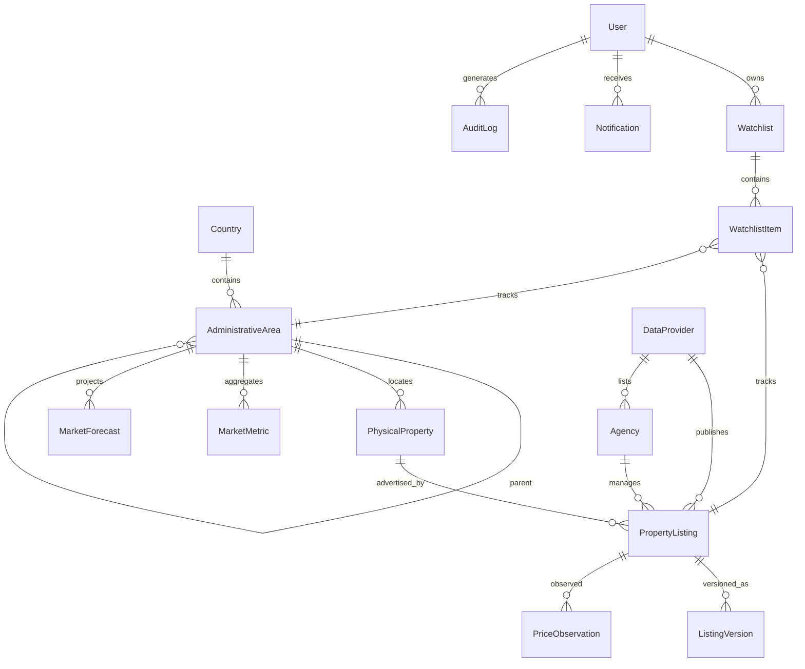

# REMIP — Modello dati

Principi: UUID stabili, timestamp UTC (`*_at`), valuta ISO 4217 esplicita su ogni
importo, separazione **immobile fisico ≠ annuncio ≠ versione ≠ fonte ≠ agenzia**.

## ER (entità implementate in Milestone 1)

## Dizionario (campi chiave)

| Entità | Campi principali | Note |
|---|---|---|
| **User** | id, email (unique), password_hash, full_name, role (`user`/`admin`), is_active, created_at | hash PBKDF2 auto-descrittivo |
| **Country** | code (ISO 3166-1 alpha-2, PK), name, currency (ISO 4217), locale, unit_system, admin_levels (json) | configurazione per Paese, no hardcoding IT |
| **AdministrativeArea** | id, country_code, level (`region`/`province`/`city`/`neighborhood`), name, slug, parent_id, centroid_lat/lon, population | gerarchia ricorsiva; geometrie PostGIS da M3 (`GeographicBoundary`) |
| **DataProvider** | id, code, name, kind (`demo`/`open_data`/`commercial`/`portal`), tos_compliant, enabled, is_demo, quality_score, notes | kill-switch per fonte |
| **Agency** | id, name, provider_id | |
| **PhysicalProperty** | id, area_id, address_text, lat, lon, property_type, size_sqm, rooms, bathrooms, floor, year_built, energy_class, features (json) | l'immobile fisico, indipendente dagli annunci |
| **PropertyListing** | id, property_id, provider_id, agency_id, source_external_id, listing_type (`sale`/`rent`), status (`active`/`removed`/`sold`/`relisted`), current_price, currency, first_seen_at, last_seen_at, published_at, dedup_confidence | un annuncio per fonte; duplicati inter-fonte → stesso property_id con confidence |
| **ListingVersion** | id, listing_id, version_number, captured_at, price, title, description, photos_count, size_sqm, rooms, energy_class, status, diff (json) | snapshot completo + diff vs versione precedente |
| **PriceObservation** | id, listing_id, observed_at, price, currency, source_code | serie prezzi per analisi |
| **MarketMetric** | id, area_id, period (primo giorno del mese), listing_type, avg_price, median_price, avg_price_sqm, median_price_sqm, active_listings, new_listings, removed_listings, avg_days_on_market, price_reduction_share, avg_discount_pct, rent_avg_sqm, gross_yield_pct, sample_size, data_quality (0-1), currency | aggregato mensile per area |
| **MarketForecast** | id, area_id, horizon_months, computed_at, base/low/high_change_pct, confidence (0-1), method, model_version, drivers (json), limitations | 3/6/12 = statistico; 60/120 = scenario strutturale |
| **Watchlist** / **WatchlistItem** | item: kind (`listing`/`area`), listing_id?, area_id?, note, initial_price, thresholds (json), notify (bool), created_at, last_checked_at | |
| **Notification** | id, user_id, type, title, body, payload (json), dedup_key (unique per user), is_read, created_at | dedup_key previene duplicati |
| **AuditLog** | id, user_id?, action, entity, entity_id, at, meta (json) | |

## Entità pianificate (milestone successive)

`GeographicBoundary` (M3, geometrie PostGIS), `SavedSearch`/`AlertRule` (M4),
`DataIngestionJob`/`DataQualityScore`/`SourceCitation` come tabelle dedicate (M4 —
in M1 qualità e fonte sono campi su provider/metriche), `EconomicIndicator`/
`GeographicIndicator` (M4), `Valuation`/`ComparableProperty` persistite (M5 — in M1
i comparabili sono calcolati on-the-fly), `UserPreference`/`NotificationPreference`
(M5), `RentalObservation` (M4), `PropertyType`/`PropertyFeature` normalizzate (M4 —
in M1 enum + json documentati).
