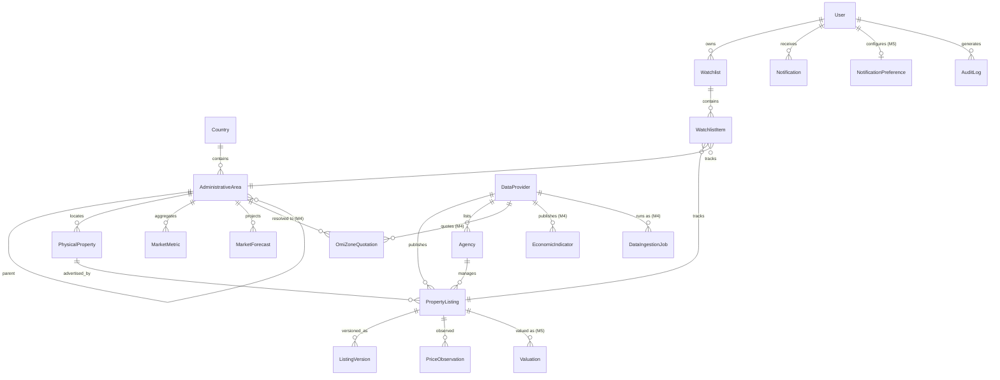

# REMIP — Modello dati

Principi: UUID stabili, timestamp UTC (`*_at`), valuta ISO 4217 esplicita su ogni
importo, separazione **immobile fisico ≠ annuncio ≠ versione ≠ fonte ≠ agenzia**.

## ER (entità implementate, Milestone 1-5)

## Dizionario (campi chiave)

| Entità | Campi principali | Note |
|---|---|---|
| **User** | id, email (unique), password_hash, full_name, role (`user`/`admin`), is_active, created_at | hash PBKDF2 auto-descrittivo |
| **Country** | code (ISO 3166-1 alpha-2, PK), name, currency (ISO 4217), locale, unit_system, admin_levels (json) | configurazione per Paese, no hardcoding IT |
| **AdministrativeArea** | id, country_code, level (`region`/`province`/`city`/`neighborhood`), name, slug, parent_id, centroid_lat/lon, population | gerarchia ricorsiva; geometrie PostGIS da M3 (`GeographicBoundary`) |
| **DataProvider** | id, code, name, kind (`demo`/`open_data`/`commercial`/`portal`), tos_compliant, enabled, is_demo, quality_score, notes | kill-switch per fonte |
| **Agency** | id, name, provider_id | |
| **PhysicalProperty** | id, area_id, address_text, lat, lon, property_type, size_sqm, rooms, bathrooms, floor, year_built, energy_class, features (json) | l'immobile fisico, indipendente dagli annunci |
| **PropertyListing** | id, property_id, provider_id, agency_id, source_external_id, listing_type (`sale`/`rent`), status (`active`/`removed`/`sold`/`relisted`), current_price, currency, first_seen_at, last_seen_at, published_at, dedup_confidence | un annuncio per fonte/agenzia; duplicati cross-agenzia → stesso property_id, confidence da `services/dedup.py` (M4) |
| **ListingVersion** | id, listing_id, version_number, captured_at, price, title, description, photos_count, size_sqm, rooms, energy_class, status, diff (json), snapshot_key | snapshot completo + diff vs versione precedente; `snapshot_key` punta al payload immutabile su object storage (`s3://...` o `file://...`, M4) |
| **PriceObservation** | id, listing_id, observed_at, price, currency, source_code | serie prezzi per analisi |
| **MarketMetric** | id, area_id, period (primo giorno del mese), listing_type, avg_price, median_price, avg_price_sqm, median_price_sqm, active_listings, new_listings, removed_listings, avg_days_on_market, price_reduction_share, avg_discount_pct, rent_avg_sqm, gross_yield_pct, sample_size, data_quality (0-1), currency | aggregato mensile per area |
| **MarketForecast** | id, area_id, horizon_months, computed_at, base/low/high_change_pct, confidence (0-1), method, model_version, drivers (json), limitations | 3/6/12 = statistico; 60/120 = scenario strutturale |
| **Watchlist** / **WatchlistItem** | item: kind (`listing`/`area`), listing_id?, area_id?, note, initial_price, thresholds (json), notify (bool), created_at, last_checked_at | |
| **Notification** | id, user_id, type, title, body, payload (json), dedup_key (unique per user), is_read, created_at | dedup_key previene duplicati |
| **AuditLog** | id, user_id?, action, entity, entity_id, at, meta (json) | |
| **DataIngestionJob** (M4) | id, provider_code, status (`running`/`success`/`failed`), trigger (`manual`/`scheduled`/`seed`), started_at, finished_at, records_fetched/created/updated, error_message | una riga per esecuzione di adapter, in coda o inline |
| **OmiZoneQuotation** (M4) | id, area_id?, provider_id, comune, zone_code, zone_description, property_type, conservation_state, period (semestre), listing_type, price_sqm_min/max, currency, source_code, ingested_at | dato di zona (non per annuncio); `area_id` nullo se la zona OMI non è stata risolta contro la geografia interna |
| **EconomicIndicator** (M4) | id, country_code, indicator_code, indicator_name, period, value, unit, source_code, ingested_at | **unica entità con dato genuinamente live**: valorizzata solo da una chiamata HTTP reale riuscita (Eurostat House Price Index) — nessuna riga se l'ingestion non è mai andata a buon fine, nessun valore sintetico di ripiego. Copertura Paese, non per città/zona |
| **Valuation** (M5) | id, listing_id, computed_at, estimated_value, range_low/high, currency, method, n_comparables, confidence (0-1), assumptions | snapshot puntuale, scritto solo su azione esplicita dell'utente (`POST /listings/{id}/valuations`), mai su una semplice visualizzazione della pagina; assente se i comparabili sono <3 (nessun valore inventato, vedi `services/comparables.py`) |
| **NotificationPreference** (M5) | id, user_id (unique), frequency (`instant`/`daily_digest`/`weekly_digest`), muted_types (json), updated_at | una riga per utente; l'assenza di riga equivale ai default (`instant`, nessun tipo silenziato); `frequency` è persistita ma solo `muted_types` è già applicato dal motore notifiche (digest batching è M6, vedi nota in `services/notifications.py`) |

## Entità pianificate (milestone successive)

`GeographicBoundary` (geometrie PostGIS reali — M6+, oggi la mappa mostra solo
marker/cluster/heatmap di annunci), `SavedSearch`/`AlertRule` (M6),
`DataQualityScore`/`SourceCitation` come tabelle dedicate (M6 — oggi qualità e
fonte sono campi su provider/metriche/risposte `data_context`),
`GeographicIndicator` (M6), `ComparableProperty` persistita (M6 — oggi i
comparabili restano calcolati on-the-fly, solo la `Valuation` risultante viene
salvata), `RentalObservation` (M6 — oggi le locazioni sono
`PropertyListing.listing_type="rent"`), `PropertyType`/`PropertyFeature`
normalizzate (M6 — oggi enum + json documentati).
